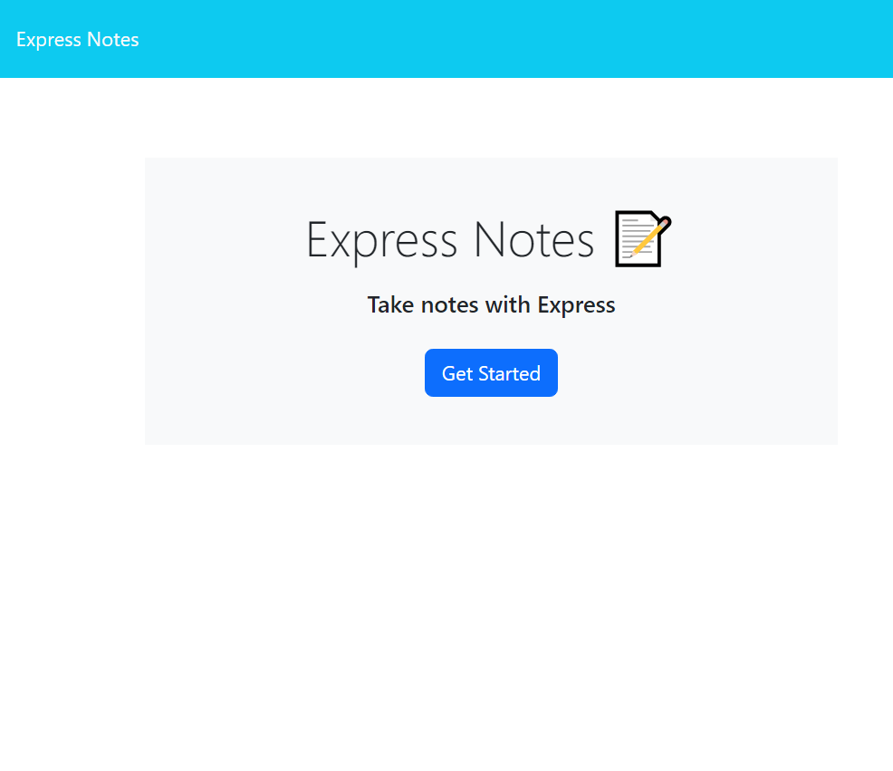
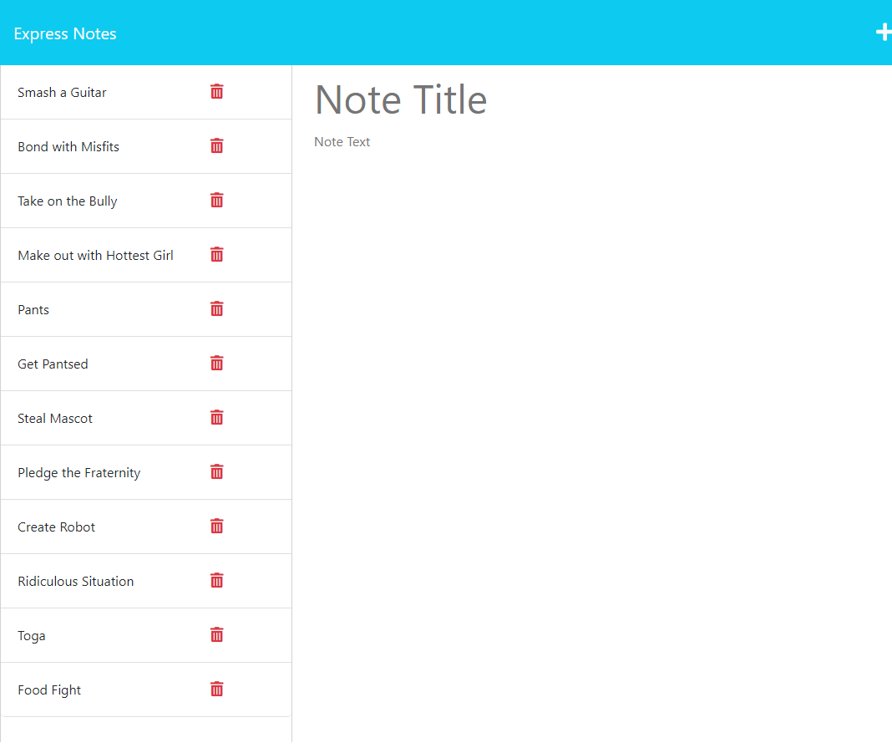

# Express Notes

  
## Table of Contents

* [Description](#description)
* [Installation](#installation)
* [Usage](#usage)
* [Contribution](#contribution)
* [Testing](#testing)
* [Questions](#questions)
* [Licensing](#licensing)

## Description

Express Notes is an easy-to-use, readily available, and central location to store your honey-do list, bucket list, to-do list, or any other list you can possibly imagine! Add and remove list items as needed from any location. Share the list with your spouse and you will never run out of tasks! 

Deployed Project: https://express-notes-with-express.herokuapp.com/

 
  
  
        
  

 
 
  
  
        
  

 

## Installation

To run Express Notes locally you'll need to first install Node.js and then use Node to install the following modules:

- express
- nodemon (recommended)

 ## Usage

 Once on the homepage, clicking the "Get Started" button will bring you to the notes section.
From here you can: 
- Click on an existing note on the left-hand column to bring that note up
- Click the **Plus** icon in the top right to begin creating a new note
- Once a new note Title and Content has been entered a **Disk** will appear in the top right
- Click the **Disk** to save and add the note to the list on the left-hand column
- Click on any **Trash** icon to remove the associated note from the list
 
## Contribution

Follow the "fork-and-pull" Git workflow.

  1. **Fork** the repo on GitHub
  2. **Clone** the project to your own machine
  3. **Commit** changes to your own branch
  4. **Push** your work back up to your fork
  5. Submit a **Pull request** so that we can review your changes

NOTE: Be sure to merge the latest from "upstream" before making a pull request!

## Testing

  
N/A

## Questions

Feel free to contact me with any questions or comments:  
<donovan.courtney@gmail.com>  
<https://github.com/decourtney>

## Licensing

Code and Docs released under [MIT License](https://choosealicense.com/licenses/mit/).
